<h1>Simon Says</h1>
<h3>A.<h3> 
Simon Says
<h4>The Game Loop</h4>
1. startButtonHandler()
2. playComputerTurn()
3. playHumanTurn()
4. checkPress()
5. resetGame() or checkRound(): If resetGame then back to 1., if checkRound back to 6..
6. resetGame() or playComputerTurn(). If resetGame, game is won. Otherwise, back to 2..

<h3>B.<h3>  
My plan is was to complete each section of the README.md and test for successes and failures along the way. After finishing I wanted to add a feature to select a level. 
<h3>C.<h3> 
I filled out code for each sections and after completing the required tasks, I went back and troubleshooted any functions that were not working properly. 
<h3>D.<h3>  
I used a variety of techniques to complete the assignments. I did my best to group up any additional variable and functions seemlessly into the code that was provided. 
<h3>E.<h3>  
I had two main pain points during this project. The first was getting the correct level to apply to the game. On my first few attempts I got the famous JS error '[object, Object]' when trying to apply the correct round max value to the status window. The second problem I had was when creating the bonus feature of selecting a level. The issue was the value from the select drop down was not being returned correctly to be used in the setLevel() function. 
<h3>F.<h3>  
I used AI tools once in the assignment, ClaudeAI. This was used to fix a bug where if the same color pad was selected twice or more in a row by the computer or the player, the sound would not play after the first time. I used AI to fix this bug as I was stumped with how to solve the problem. I used this as an opportunity to practice with AI without relying on it for the whole project. I was encouraged throughout the course by the mentors to become familiar with these AI tools. After prompting ClaudeAI, it helped provide a solution that was rather simple. 
<h3>G.<h3>  
I knew the project would take time to complete, so I set aside a few days to complete it in ~3 hour sessions. I started by completing all of the functions and user stories in order from the README.md. Afterwards, I tested the game and solved the aforementioned large bugs that prevented the game from having a max round limit. After solving the bugs of the main game, I implemented the feature to select the level of challenge for the game. This led to more bugs that required tests to see at what point the problems were occuring. I used to drop down box to select the desired level and finished by changing some of the colors and the background for the website. I cleaned up the text and made my level select addition to match the visual effects of the provided CSS button to make the site cohesive in design. At one point I attempted to make the layout more horizontal but it made the game unplayable on mobile devices so I reverted those changes. 

<h4>Break Down of Key Funcions</h4>

*changeLevel()* This was one function that I added to implment the level chagning feature. It starts by searching for the element ID for the 'level-selector' select element in the index.html file and returns the value. That value is then used when the startButtonHandler() is called to start the games. The value from the changeLevel() function is then fed into the setLevel() function.

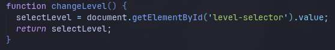

*startButtonHandler()* This function starts the game and activates when the start button is clicked. The function calls setLevel() to set the level and then increments the roundCount varialbe. Then, the function hides the start button and replaces it with the status screen. I also mafe the function grey out and make the level selector dropdown unclickable. 

*padHandler()* The padHandler function is called when a pad is clicked. 
- Takes the color from the activated pad and stores it in a variable. 
- Plays sound coresponding to the color clicked. 

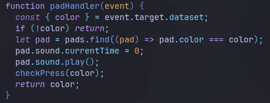

*setLevel()*
- Sets the level of the game, defaulting to level 1. 
- Sets the approproate amount of rounds for the level chosen. 

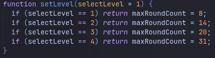

*getRandomItem()*
- Randomly selects a color from the pads array equal to round number. 

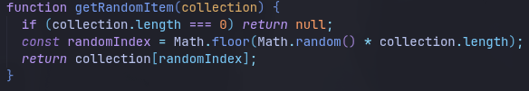

*setText()*
- Sets the status of the status screen to a given message.

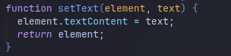

*activatePad()* 
- Activates pad of given color. Uses the .find() method to search for the corresponding pad color in the pads array. It then adds the 'activated' class to the html element to temporarily apply a css style. It removes the styling at the end of the function. It also plays the sound for when a color is activated. 

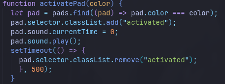

*activatePads()* 
- This function takes the sequence array then calls the activatePad() function for each color in the sequence. 

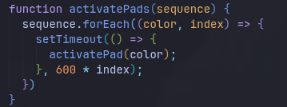

*playComputerTurn()*
- Called when the game is started and makes the pads unclickable by adding a style to the pad html elements. 
- Changes the status to Simon says by calling the SetText() funtion and passing in a message.
- Displays the current round of the level. 
- Calls the activatePads() function.
- Calls the playHumanTurn() funtion.

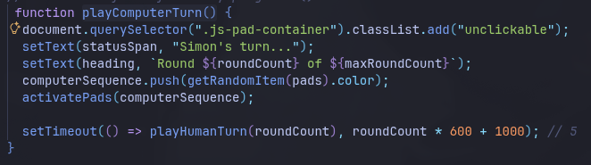

*playHumanTurn()*
- Removes the unclickable style from the pads using document.querySelector().classList.remove('unclickable').
- Sets status text for "Players turn..."

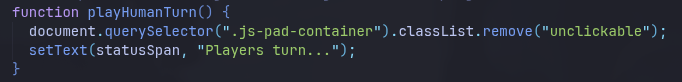

*checkPress()*
- Displays how many moves are left in the round if the players has not made all of thier moves. 
- If the player makes a mistake, the function ends and the game is reset.
- When there are no guesses left in the round, calls the checkRound() function. 

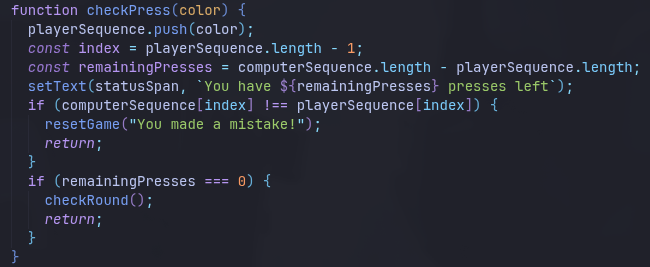

*checkRound()*
- Checks to see if the has made all of thier moves. Increments roundCount after compling the round. 
- Empties the playerSequence array. 
- Calls the playComputerTurn().

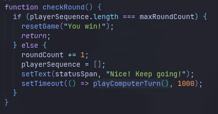

*resetGame()*
- Empties the computerSequence and playerSequence arrays, sets the roundCount to 0. Resets to the main menu. 
- Reveals the Start button and hides the status menu. Makes the pads unclickable. Removes the unclickalbe style from the levelSelector dropdown. 

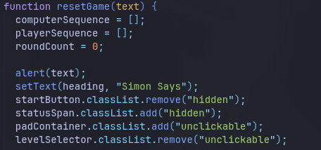

<h3>H.<h3>  
See github commits via provided links

TO DO:
However, it would benefit from a more structured technical explanation of key functions and logic. Also, while commit history is present, Replit or development screenshots are missing, which are required.

Optional:
1. Add more comments for better code readability
2. Include features like score tracking or animations
3. Show test results (e.g., npm test)